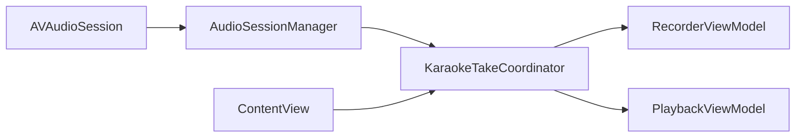

# iOS Karaoke Recorder

A minimal reference implementation for simultaneous audio playback and recording on iOS using `AVAudioRecorder`, `AVAudioPlayer`, and a shared `AVAudioSession`.

Build vocal practice apps with confidence — explicit about iOS constraints, no fake sync guarantees.

---

## What This Does

- Plays a **local backing track** (MP3, WAV, etc.)
- Records **microphone input in real time**
- Coordinates both through a single **take owner** (`KaraokeTakeCoordinator`)
- Requests microphone permission with a proper usage string
- Handles interruptions (calls, Siri) and headphone unplug pauses
- Copies imported tracks into the app sandbox for reliable playback
- Stores recordings locally with predictable file naming
- Plays back recorded takes immediately (solo — backing track stops first)

---

## What This Doesn't Do

- Record system audio (iOS forbids this)
- Integrate with YouTube, Spotify, or Apple Music
- Enable background recording
- Apply effects, pitch correction, or mixing
- Provide sample-accurate sync between backing track and vocal take
- Mix a saved take over the backing track during review

**Why?** iOS audio is sandboxed by design. This project respects those boundaries rather than fight them.

---

## Core Architecture

On iOS, audio is **borrowed, not owned**. `AVAudioSession` is the negotiation layer between your app and the OS over shared hardware.



### Components

| File | Role |
|------|------|
| `AudioSessionManager.swift` | Configures `.playAndRecord`, listens for interruption/route events |
| `KaraokeTakeCoordinator.swift` | Owns the concept of a "take" — start/stop/pause/resume for recorder + track together |
| `RecorderViewModel.swift` | Mic permission, `AVAudioRecorder`, metering, take list |
| `PlaybackViewModel.swift` | Backing track import/copy, `AVAudioPlayer`, solo take playback |
| `ContentView.swift` | SwiftUI UI only — no audio coordination logic |

### Audio stack choice

This app uses **file-oriented** APIs (`AVAudioRecorder` + `AVAudioPlayer`), not `AVAudioEngine`. That keeps the code small and readable, but means:

- Backing track and vocal take start within tens of milliseconds of each other — fine for practice, not sample-locked
- Review playback is solo (take OR track, not mixed on a shared bus)

These are **design constraints**, not bugs. Moving to `AVAudioEngine` would be a separate architectural fork.

---

## Getting Started

### Requirements

- iOS 16+
- Xcode 15+
- Swift 5.9+
- Real device recommended for mic/audio routing tests

### Build and Run

```bash
git clone https://github.com/JoshCCorby/ios-karaoke-recorder.git
cd ios-karaoke-recorder
open VocalPractice.xcodeproj
```

Select your device or simulator and press **Run** (⌘R). Set your development team in the target signing settings before running on a physical device.

An optional Swift Package (`Package.swift`) exists for source browsing; **Xcode is the primary build path** for the iOS app.

### Add a Backing Track

1. Tap **Import Track** in the app
2. Pick an audio file from Files
3. The file is copied into the app sandbox under `Documents/backing-tracks/`
4. Tap record to start a take — backing track starts automatically if loaded

---

## Permissions

`Info.plist` includes `NSMicrophoneUsageDescription`. On first record attempt, the app calls `requestRecordPermission`. If denied, the UI explains how to enable access in Settings.

---

## Interruption and Route Handling

- **Phone call / Siri** — take pauses; resumes automatically if iOS sets `.shouldResume`
- **Headphones unplugged mid-take** — take pauses; does **not** auto-resume (avoids speaker blast + mic bleed)
- User can tap **Resume** or **Stop** after a pause

See `AudioSessionManager.swift` and `KaraokeTakeCoordinator.swift` for the full flow.

---

## File Structure

```
ios-karaoke-recorder/
├── VocalPractice.xcodeproj/    # Primary iOS app target
├── VocalPracticeApp.swift      # App entry
├── ContentView.swift           # SwiftUI UI
├── KaraokeTakeCoordinator.swift
├── AudioSessionManager.swift
├── RecorderViewModel.swift
├── PlaybackViewModel.swift
├── Info.plist
├── Assets.xcassets
├── Package.swift               # Optional SPM executable
└── web-preview/                # React UI mock
```

---

## Testing

- Test on a **real device** — simulator audio routing is unreliable
- Deny mic permission → confirm alert and Settings link
- Import a track from Files → quit app → relaunch → track still plays
- Start a take → simulate interruption → confirm pause/resume
- Unplug headphones mid-take → confirm pause, no auto-resume
- Play a saved take while backing track was playing → only take is heard

---

## Known Limitations

- Simulator audio is not reliable — use a real device
- Only one backing track at a time (by design)
- No audio effects or processing (out of scope)
- No cloud sync (out of scope for v1)
- Loose A/V sync between track and vocal (by design — see architecture)

---

## Tech Stack

- **Language:** Swift
- **Framework:** AVFoundation (`AVAudioSession`, `AVAudioRecorder`, `AVAudioPlayer`)
- **UI:** SwiftUI
- **Platform:** iOS 16+
- **Dependencies:** None

---

## License

Apache-2.0 — see [LICENSE](LICENSE).

---

## Useful Resources

- [AVAudioSession](https://developer.apple.com/documentation/avfoundation/avaudiosession)
- [Configuring Your App's Audio Session](https://developer.apple.com/documentation/avfoundation/configuring-your-app-for-media-playback)
- [Recording Audio](https://developer.apple.com/documentation/avfoundation/audio_playback_recording_and_processing)
